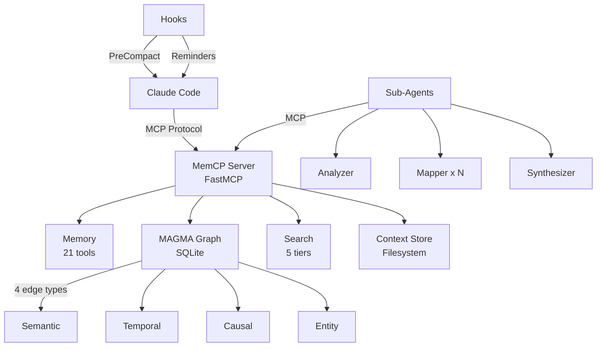

<p align="center">

```
 ██████   ██████ ██████████ ██████   ██████   █████████  ███████████
░░██████ ██████ ░░███░░░░░█░░██████ ██████   ███░░░░░███░░███░░░░░███
 ░███░█████░███  ░███  █ ░  ░███░█████░███  ███     ░░░  ░███    ░███
 ░███░░███ ░███  ░██████    ░███░░███ ░███ ░███          ░██████████
 ░███ ░░░  ░███  ░███░░█    ░███ ░░░  ░███ ░███          ░███░░░░░░
 ░███      ░███  ░███ ░   █ ░███      ░███ ░░███     ███ ░███
 █████     █████ ██████████ █████     █████ ░░█████████  █████
░░░░░     ░░░░░ ░░░░░░░░░░ ░░░░░     ░░░░░   ░░░░░░░░░  ░░░░░
```

  <p align="center">
    <strong>Persistent Memory MCP Server for Claude Code</strong><br/>
    <em>Never lose context again.</em>
  </p>
  <p align="center">
    <a href="https://www.python.org/downloads/"></a>
    <a href="LICENSE"></a>
    <a href="https://github.com/mohamedali-may/memcp/actions"></a>
    <a href="https://pypi.org/project/memcp/"></a>
  </p>
</p>

---

## Why MemCP?

Claude Code loses everything after `/compact`. Previous decisions, insights, technical findings, and conversation context vanish. Long sessions hit the context window limit and critical information gets pushed out. Every new session starts from scratch.

**MemCP solves this.** It gives Claude a persistent external memory — a place to store, organize, and retrieve knowledge across sessions without consuming context window tokens.

| Problem | How MemCP Solves It |
|---------|-------------------|
| Context lost after `/compact` | Auto-save hooks force Claude to persist insights before compact |
| Session boundaries erase knowledge | Insights persist in SQLite across all sessions |
| Large documents fill context window | Content stays on disk as named variables; Claude loads only what it needs |
| No way to connect related knowledge | MAGMA 4-graph links insights via semantic, temporal, causal, and entity edges |
| Search is limited to current session | Tiered search (keyword → BM25 → semantic → hybrid) across all stored content |

MemCP implements the **RLM framework** (Recursive Language Model, [arXiv:2512.24601](https://arxiv.org/abs/2512.24601)) — an active exploration model where content stays on disk and Claude decides what to load, rather than passive RAG retrieval.

---

## Architecture



**3-layer delegation**: `server.py` (MCP endpoints) → `tools/*.py` (orchestration) → `core/*.py` (business logic)

**Storage**: SQLite for the knowledge graph (`graph.db`) + filesystem for contexts and chunks (`~/.memcp/`)

**Dependencies**: Only 2 core packages (`mcp`, `pydantic`). Everything else is optional and unlocks progressively better capabilities.

---

## Features

### Memory & Knowledge Graph
- **21 MCP tools** — remember, recall, forget, search, chunk, filter, traverse, and more
- **MAGMA 4-graph** — insights connect via semantic, temporal, causal, and entity edges in SQLite
- **Intent-aware recall** — "why did we choose X?" follows causal edges; "when was Y decided?" follows temporal edges
- **Auto entity extraction** — regex-based (files, modules, URLs, CamelCase) + LLM-based via sub-agents

### Context Management
- **Context-as-variable** — large content stored on disk, Claude sees only metadata (type, size, token count)
- **6 chunking strategies** — auto, lines, paragraphs, headings, chars, regex
- **RLM navigation** — peek, grep, filter without loading entire documents

### Search
- **5-tier search** — keyword (stdlib) → BM25 (bm25s) → fuzzy (rapidfuzz) → semantic (model2vec/fastembed) → hybrid fusion
- **Graceful degradation** — always works with zero optional deps; each extra unlocks better search
- **Token budgeting** — `max_tokens` parameter caps how much enters the context window

### Sub-Agents (RLM Map-Reduce)
- **4 Claude Code sub-agents** — analyzer, mapper, synthesizer, entity-extractor
- **Parallel chunk processing** — mappers run on Haiku in background, synthesizer combines on Sonnet
- **Independent context windows** — sub-agents don't consume your main context

### Lifecycle & Organization
- **Auto-save hooks** — PreCompact blocks until context is saved; progressive reminders at 10/20/30 turns
- **3-zone retention** — Active → Archive (compressed) → Purge (logged deletion)
- **Multi-project** — auto-detects project from git root, namespaces all data
- **Multi-session** — tracks sessions with timestamps and insight counts

### Developer Experience
- **341 tests** across 16 test files, CI on Python 3.10/3.11/3.12
- **Interactive installer** — step-by-step setup with `bash scripts/install.sh`
- **Docker support** — single-command containerized deployment
- **Zero-config** — works out of the box with sensible defaults

---

## Installation

### Quick Install (Recommended)

```bash
git clone https://github.com/mohamedali-may/memcp.git
cd memcp
bash scripts/install.sh
```

The interactive installer will:
1. Check Python version, pip, Claude CLI
2. Ask your preferred install method (dev/pip/Docker)
3. Let you choose optional features (search, semantic, fuzzy, cache)
4. Install MemCP and verify the import
5. Register the MCP server with Claude Code
6. Deploy 4 RLM sub-agents to `~/.claude/agents/` (user-level, available across all projects)
7. Merge auto-save hooks into `~/.claude/settings.json` (preserves existing settings)
8. Deploy `CLAUDE.md` to your project (session instructions for Claude Code)

### Docker

```bash
# Build and run
docker build -t memcp .
claude mcp add memcp -- docker run --rm -i \
  -v ~/.memcp:/data -e MEMCP_DATA_DIR=/data memcp
```

Or with docker-compose:

```bash
docker-compose up -d
claude mcp add memcp -- docker run --rm -i \
  -v ~/.memcp:/data -e MEMCP_DATA_DIR=/data memcp
```

### Manual Installation

```bash
# 1. Create virtual environment
python3 -m venv .venv
source .venv/bin/activate

# 2. Install (choose your extras)
pip install -e "."                          # Core only
pip install -e ".[search,fuzzy]"            # + BM25 + typo tolerance
pip install -e ".[search,fuzzy,semantic]"   # + vector embeddings
pip install -e ".[all]"                     # Everything

# 3. Register with Claude Code
claude mcp add memcp .venv/bin/python -- -m memcp.server -s user

# 4. Deploy sub-agents (user-level, available across all projects)
mkdir -p ~/.claude/agents
cp templates/agents/memcp-*.md ~/.claude/agents/

# 5. Merge hooks into global Claude Code settings
# If ~/.claude/settings.json doesn't exist or is empty:
cp templates/settings.json ~/.claude/settings.json
# If it already has content, manually merge the "hooks" key from templates/settings.json

# 6. Deploy CLAUDE.md to your project
cp templates/CLAUDE.md ./CLAUDE.md

# 7. Verify
# In a Claude Code session, type: memcp_ping()
```

### Uninstall

```bash
bash scripts/uninstall.sh
```

The uninstaller lets you choose what to remove: MCP registration, sub-agents (`~/.claude/agents/`), hooks (from `~/.claude/settings.json`), virtual environment, data directory, or everything.

---

## How It Works

MemCP follows the **RLM (Recursive Language Model)** framework: content is stored externally as named variables, and Claude actively navigates to what it needs — rather than passively receiving retrieved chunks (RAG).

### The Flow

```
Session Start
  │
  ├─ memcp_recall(importance="critical")     ← Load critical rules
  ├─ memcp_status()                          ← See memory stats
  │
  │  ... working ...
  │
  ├─ memcp_remember("Decided to use Redis",  ← Save a decision
  │     category="decision",
  │     importance="high",
  │     tags="architecture,cache")
  │
  │  ... context filling up ...
  │
  ├─ [Hook] "Consider saving context"        ← Auto-reminder at 10 turns
  │
  ├─ memcp_load_context("session-notes",     ← Store large content on disk
  │     content="...")
  │
  │  ... /compact ...
  │
  ├─ [Hook] "SAVE REQUIRED"                  ← Blocks until saved
  ├─ memcp_remember(...)                     ← Save remaining insights
  │
Next Session
  │
  ├─ memcp_recall(importance="critical")     ← Everything is still here
  └─ memcp_search("Redis decision")          ← Full search across sessions
```

### Context-as-Variable (RLM)

Instead of loading a 50K-token document into the prompt:

```
memcp_load_context("report", file_path="large_report.md")
memcp_inspect_context("report")          → type=markdown, 18K tokens, preview
memcp_chunk_context("report", "headings") → 12 chunks created
memcp_peek_chunk("report", 3)            → reads only chunk #3 (~1500 tokens)
memcp_filter_context("report", "TODO|FIXME")  → matching lines only
```

**Result**: ~1500 tokens in context instead of 18,000. A 92% reduction.

### Knowledge Graph (MAGMA)

Every `memcp_remember()` creates a graph node and auto-generates edges:

```
memcp_remember("Use SQLite for graph", category="decision", tags="db")
  │
  ├── temporal edge → insights created in last 30 min
  ├── entity edge  → other insights mentioning "SQLite"
  ├── semantic edge → top-3 similar insights by content overlap
  └── causal edge  → if "because"/"therefore" detected, links to cause
```

Then `memcp_recall("why SQLite?")` detects "why" intent and follows **causal** edges to find the reasoning.

---

## Usage Examples

### 1. Remember Decisions Across Sessions

```
memcp_remember(
    "Never push directly to main — always use PRs with at least 1 review",
    category="decision",
    importance="critical",
    tags="git,workflow"
)
```

Next session: `memcp_recall(importance="critical")` loads this rule automatically.

### 2. Analyze a Large Codebase File

```
memcp_load_context("api-module", file_path="src/api/routes.py")
memcp_inspect_context("api-module")
  → python, 2400 lines, ~15K tokens
memcp_chunk_context("api-module", strategy="lines", chunk_size=100)
  → 24 chunks created
memcp_filter_context("api-module", "def\\s+\\w+")
  → all function definitions (50 lines instead of 2400)
memcp_peek_chunk("api-module", 5)
  → read chunk #5 in detail
```

### 3. Cross-Reference with Graph Traversal

```
memcp_remember("Found race condition in file writer", category="finding", tags="bug,concurrency")
memcp_remember("Fixed race condition with flock", category="decision", tags="bug,concurrency")

memcp_related("abc123", edge_type="causal")
  → shows the finding linked to the fix decision
memcp_graph_stats()
  → 42 nodes, 287 edges, top entities: ["file writer", "flock", ...]
```

### 4. Map-Reduce with Sub-Agents

For analyzing a large document across multiple chunks in parallel:

1. `memcp_chunk_context("design-doc", "auto")` — partition
2. Launch `memcp-mapper` instances in background (one per chunk, Haiku)
3. Launch `memcp-synthesizer` in foreground with all mapper outputs (Sonnet)
4. Get a coherent answer with citations, cross-referenced against the knowledge graph

---

## Project Structure

```
memcp/
├── src/memcp/
│   ├── server.py                # FastMCP server — 21 tool definitions
│   ├── config.py                # Environment config (dataclass)
│   ├── core/
│   │   ├── memory.py            # remember, recall, forget, status
│   │   ├── graph.py             # MAGMA 4-graph (SQLite + auto-edges)
│   │   ├── context_store.py     # Named context variables on disk
│   │   ├── chunker.py           # 6 splitting strategies
│   │   ├── search.py            # Tiered: keyword → BM25 → semantic → hybrid
│   │   ├── embeddings.py        # Model2Vec / FastEmbed providers
│   │   ├── vecstore.py          # Numpy vector store (cosine similarity)
│   │   ├── embed_cache.py       # Disk cache for embeddings
│   │   ├── retention.py         # 3-zone lifecycle (active → archive → purge)
│   │   ├── project.py           # Git root detection + session management
│   │   └── fileutil.py          # Atomic writes, flock, safe names
│   └── tools/
│       ├── context_tools.py     # Context + chunking tool implementations
│       ├── search_tools.py      # Search tool implementation
│       ├── graph_tools.py       # Graph traversal tools
│       ├── retention_tools.py   # Retention lifecycle tools
│       └── project_tools.py     # Project/session tools
├── hooks/
│   ├── pre_compact_save.py      # Block /compact until context saved
│   ├── auto_save_reminder.py    # Progressive reminders (10/20/30 turns)
│   └── reset_counter.py         # Reset counter after saves
├── templates/                   # Deployed by installer to target locations
│   ├── CLAUDE.md                # Session instructions (deployed to project root)
│   ├── settings.json            # Hook registration (merged into ~/.claude/settings.json)
│   └── agents/                  # RLM sub-agent templates (deployed to ~/.claude/agents/)
│       ├── memcp-analyzer.md    # Peek → identify → load → analyze
│       ├── memcp-mapper.md      # MAP phase (Haiku, parallel)
│       ├── memcp-synthesizer.md # REDUCE phase (Sonnet)
│       └── memcp-entity-extractor.md  # LLM entity extraction
├── scripts/
│   ├── install.sh               # Interactive installer (8 steps)
│   └── uninstall.sh             # Cleanup script
├── docs/
│   ├── ARCHITECTURE.md          # System design + Mermaid diagrams
│   ├── TOOLS.md                 # All 21 tools reference
│   ├── SEARCH.md                # Tiered search system
│   ├── GRAPH.md                 # MAGMA 4-graph memory
│   ├── HOOKS.md                 # Auto-save hooks
│   ├── COMPARISON.md            # MemCP vs alternatives
│   └── adr/                     # Architecture Decision Records
│       ├── README.md            # ADR index
│       ├── 001-sqlite-filesystem-hybrid-storage.md
│       ├── 002-tiered-search-architecture.md
│       ├── 003-magma-4-graph-memory.md
│       ├── 004-sub-agents-over-sub-llms.md
│       ├── 005-minimal-core-dependencies.md
│       ├── 006-mcp-tools-over-python-repl.md
│       ├── 007-auto-save-hook-architecture.md
│       ├── 008-three-zone-retention-lifecycle.md
│       ├── 009-user-level-global-deployment.md
│       └── 010-twelve-factor-configuration.md
├── tests/                       # 16 test files, 341 tests
├── .github/workflows/
│   ├── ci.yml                   # Lint + test matrix + Docker build
│   └── release.yml              # PyPI publish on tag
├── pyproject.toml               # Build config + deps + ruff + pytest
├── Dockerfile                   # Python 3.12-slim
├── docker-compose.yml           # Volume mount for ~/.memcp
├── CONTRIBUTING.md              # Contributor guidelines
├── SECURITY.md                  # Security policy
└── LICENSE                      # MIT
```

---

## Configuration

All configuration is via environment variables (12-factor):

| Variable | Default | Description |
|----------|---------|-------------|
| `MEMCP_DATA_DIR` | `~/.memcp` | Data storage directory |
| `MEMCP_MAX_INSIGHTS` | `10000` | Max insight count before auto-pruning |
| `MEMCP_MAX_CONTEXT_SIZE_MB` | `10` | Max size per context variable |
| `MEMCP_MAX_MEMORY_MB` | `2048` | Max total memory usage |
| `MEMCP_IMPORTANCE_DECAY_DAYS` | `30` | Half-life for importance decay |
| `MEMCP_RETENTION_ARCHIVE_DAYS` | `30` | Days before archiving stale items |
| `MEMCP_RETENTION_PURGE_DAYS` | `180` | Days before purging archived items |
| `MEMCP_EMBEDDING_PROVIDER` | `auto` | `model2vec`, `fastembed`, or `auto` |
| `MEMCP_SEARCH_ALPHA` | `0.6` | Hybrid search blend (0=BM25 only, 1=semantic only) |

---

## Optional Dependencies

MemCP's tiered dependency system means core features work with zero extras:

| Extra | Package | What It Unlocks | Size |
|-------|---------|----------------|------|
| `search` | bm25s | BM25 ranked keyword search | ~5MB |
| `fuzzy` | rapidfuzz | Typo-tolerant matching | ~2MB |
| `semantic` | model2vec + numpy | Vector embeddings (256d) | ~40MB |
| `semantic-hq` | fastembed + numpy | Higher quality embeddings (384d) | ~200MB |
| `cache` | diskcache | Persistent embedding cache | ~1MB |
| `vectors` | sqlite-vec | SIMD-accelerated KNN in SQLite | ~2MB |

```bash
pip install memcp                          # Core (keyword search)
pip install memcp[search,fuzzy]            # + ranked search + typo tolerance
pip install memcp[search,semantic,cache]   # + vector embeddings + caching
pip install memcp[all]                     # Everything
```

---

## Documentation

| Document | Description |
|----------|-------------|
| [templates/CLAUDE.md](templates/CLAUDE.md) | Session instructions for Claude Code — deployed to project root by installer |
| [docs/ARCHITECTURE.md](docs/ARCHITECTURE.md) | System design with Mermaid diagrams, data flows, directory layout |
| [docs/TOOLS.md](docs/TOOLS.md) | All 21 tools — signatures, parameters, examples, tips |
| [docs/SEARCH.md](docs/SEARCH.md) | Tiered search system — how each tier works, installation, degradation |
| [docs/GRAPH.md](docs/GRAPH.md) | MAGMA 4-graph — edge types, intent detection, entity extraction, traversal |
| [docs/HOOKS.md](docs/HOOKS.md) | Auto-save hooks — setup, behavior, customization |
| [docs/COMPARISON.md](docs/COMPARISON.md) | MemCP vs rlm-claude, CLAUDE.md, Letta, mem0, MAGMA |
| [docs/adr/](docs/adr/) | Architecture Decision Records — 10 ADRs documenting key technical choices |

---

## Development

```bash
# Setup
python3 -m venv .venv && source .venv/bin/activate
pip install -e ".[dev]"

# Run tests
pytest tests/ -v

# Run tests with search extras
pip install -e ".[dev,search,fuzzy,semantic]"
pytest tests/ -v

# Lint
ruff check src/ tests/
ruff format src/ tests/

# Run the server directly
python -m memcp.server
```

### CI/CD

- **GitHub Actions** runs on every push: lint (ruff) + test matrix (Python 3.10/3.11/3.12) + Docker build
- **Release** workflow publishes to PyPI on `v*` tag push

---

## Contributing

See [CONTRIBUTING.md](CONTRIBUTING.md) for guidelines on:
- Setting up the development environment
- Code style and conventions
- Testing requirements
- Submitting pull requests

---

## Security

See [SECURITY.md](SECURITY.md) for:
- Reporting vulnerabilities
- Security design decisions
- Data storage considerations

**Key security properties:**
- All data stored locally (`~/.memcp/`) — nothing leaves your machine
- Atomic file writes with `fcntl.flock` for concurrent access safety
- Input validation via `safe_name()` prevents path traversal
- SQLite WAL mode for ACID-compliant graph operations
- No network calls (unless using remote embedding providers)

---

## License

[MIT](LICENSE) — see the LICENSE file for details.

---

## Authors

- **Mohamed Ali May** — Creator and maintainer
- **Claude Opus 4.5** — (joint R&D)

---

## Acknowledgments & Inspirations

MemCP builds on ideas from several research papers and projects:

- **[RLM: Recursive Language Models](https://arxiv.org/abs/2512.24601)** (MIT, 2025) — The context-as-variable framework and recursive sub-query pattern that MemCP implements
- **[MAGMA: Multi-Agent Graph Memory Architecture](https://arxiv.org/abs/2601.03236)** (2026) — The 4-graph memory model (semantic, temporal, causal, entity edges) adapted for MemCP's knowledge graph
- **[FastMCP](https://github.com/jlowin/fastmcp)** — The Python MCP framework used for tool definitions
- **[Claude Code](https://docs.anthropic.com/en/docs/claude-code)** — Anthropic's CLI that MemCP extends with persistent memory
- **[rlm-claude](https://github.com/EncrEor/rlm-claude)** — Exploring RLM concepts for Claude Code memory using skills
- **[Letta (MemGPT)](https://github.com/letta-ai/letta)** — Pioneering work on LLM memory systems
- **[mem0](https://github.com/mem0ai/mem0)** — Embedding-based memory layer for AI applications
