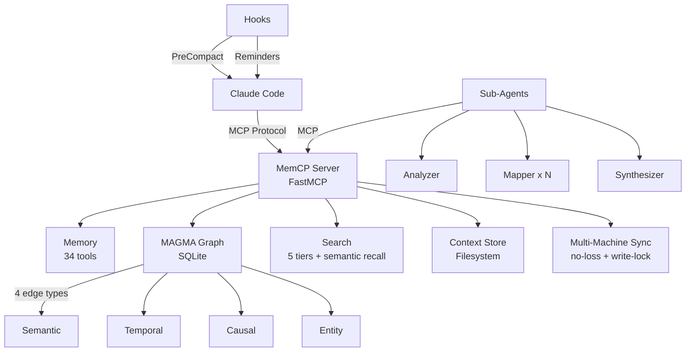

<p align="center">

```
 ██████   ██████ ██████████ ██████   ██████   █████████  ███████████
░░██████ ██████ ░░███░░░░░█░░██████ ██████   ███░░░░░███░░███░░░░░███
 ░███░█████░███  ░███  █ ░  ░███░█████░███  ███     ░░░  ░███    ░███
 ░███░░███ ░███  ░██████    ░███░░███ ░███ ░███          ░██████████
 ░███ ░░░  ░███  ░███░░█    ░███ ░░░  ░███ ░███          ░███░░░░░░
 ░███      ░███  ░███ ░   █ ░███      ░███ ░░███     ███ ░███
 █████     █████ ██████████ █████     █████ ░░█████████  █████
░░░░░     ░░░░░ ░░░░░░░░░░ ░░░░░     ░░░░░   ░░░░░░░░░  ░░░░░
```

  <p align="center">
    <strong>Persistent Memory MCP Server for Claude Code</strong><br/>
    <em>Never lose context again.</em>
  </p>
  <p align="center">
    <a href="https://www.python.org/downloads/"></a>
    <a href="LICENSE"></a>
    <a href="https://github.com/mohamedali-may/memcp/actions"></a>
    <a href="https://pypi.org/project/memcp/"></a>
  </p>
</p>

---

## A personal fork of MemCP

This is a personal fork of **[MemCP by Mohamed Ali May](https://github.com/maydali28/memcp)** (MIT). The hard part — the MAGMA knowledge graph, the RLM map-reduce design, the tiered search, the whole core — is his work, and it's genuinely good. Full credit to him. **If you're evaluating MemCP, start with [the upstream repo](https://github.com/maydali28/memcp);** it's the canonical project, and this fork is a superset I maintain for my own use.

**Why a fork rather than a pull request?** I run MemCP every day, and a few needs specific to my setup had me iterating fast on my own copy — fast enough that I didn't want to push my opinions onto the upstream roadmap or make Mohamed review a steady stream of personal changes. So I kept them here instead:

- I drive **one memory store from several machines**, so I needed no-loss multi-machine sync (snapshot sync + a write-lock).
- At ~1,500 stored insights, exact "I know the ID / phrase / tag" lookups are faster and more reliable as plain grep than as semantic search — hence `memcp_grep`.
- I wanted semantic recall ranking with theme bridging, episodic memory, and a few insight-lifecycle tools.

None of this changes how upstream behaves — it's all additive, and the original tools work exactly as before. **These changes are available to upstream if Mohamed wants any of them** — happy to open PRs. The fork just lets me move at my own pace without asking him to adopt my preferences.

**What this fork adds over upstream:**

- **`memcp_grep` — exact / known-item retrieval.** Regex + tag-conjunction search over the insight store, no embeddings and no ranking — the right tool when you already know the ID, an exact phrase, or a tag combo. Complements semantic recall rather than replacing it.
- **`memcp_topic` — living-doc content versioning.** A `topic:` / `entry:` / `supersedes:` tag convention over ordinary append-only saves, read back as "compiled truth on top + chronological timeline below." Lets a record that keeps changing live as a chain of new-id inserts (which converge cross-machine) instead of in-place content edits (which don't) — no new storage, sync surface, or schema change.
- **Semantic recall with theme bridging.** A semantic-similarity term in the recall ranker, a bge-small "hq" embedding tier with asymmetric query encoding, and theme-enriched embeddings that bridge related insights. Degrades cleanly to keyword search when embeddings aren't available.
- **No-loss multi-machine sync.** Snapshot-based sync (`memcp_sync`) with a write-lock, tombstones, and union-merge, so one memory store can be driven from several machines without clobbering — plus `memcp_reindex` for cross-machine index rebuilds.
- **Episodic memory.** `memcp_log_episode` / `memcp_recall_episodes` — record what an approach was and how it turned out, for later replay.
- **Insight lifecycle.** `memcp_index` (a progressive-disclosure map of all insights), `memcp_get` (fetch by id), `memcp_update` (retag / reclassify in place, preserving edges), `memcp_archive`, and revision tracking.
- **Telemetry** for tool usage.

That's **34 MCP tools** (up from upstream's 24) across **8 new core subsystems** (`semantic_recall`, `theme_cache`, `snapshot_sync`, `write_lock`, `reindex`, `revision`, `telemetry`, `embedding_text`). Per-feature detail is in [docs/](docs/).

---

## Why MemCP?

Claude Code loses everything after `/compact`. Previous decisions, insights, technical findings, and conversation context vanish. Long sessions hit the context window limit and critical information gets pushed out. Every new session starts from scratch.

**MemCP solves this.** It gives Claude a persistent external memory — a place to store, organize, and retrieve knowledge across sessions without consuming context window tokens.

| Problem | How MemCP Solves It |
|---------|-------------------|
| Context lost after `/compact` | Auto-save hooks force Claude to persist insights before compact |
| Session boundaries erase knowledge | Insights persist in SQLite across all sessions |
| Large documents fill context window | Content stays on disk as named variables; Claude loads only what it needs |
| No way to connect related knowledge | MAGMA 4-graph links insights via semantic, temporal, causal, and entity edges |
| Search is limited to current session | Tiered search (keyword → BM25 → semantic → hybrid) across all stored content |

MemCP implements the **map-reduce pattern** from the RLM framework (Recursive Language Model, [arXiv:2512.24601](https://arxiv.org/abs/2512.24601)) — content stays on disk as named variables, Claude decides what to load, and a single-level fan-out of mapper sub-agents feeds a synthesizer. Single-level by design: see [ADR-006](docs/adr/006-mcp-tools-over-python-repl.md) for the choice to expose typed MCP tools instead of the paper's Python REPL (which is what enables paper-style recursive sub-calls).

---

## Architecture



**3-layer delegation**: `server.py` (MCP endpoints) → `tools/*.py` (orchestration) → `core/*.py` (business logic)

**Storage**: SQLite for the knowledge graph (`graph.db`) + filesystem for contexts and chunks (`~/.memcp/`)

**Dependencies**: Only 2 core packages (`mcp`, `pydantic`). Everything else is optional and unlocks progressively better capabilities.

---

## Features

### Memory & Knowledge Graph
- **34 MCP tools** — remember, recall, forget, search, grep, topic, index, update, chunk, filter, traverse, reinforce, consolidate, sync, and more
- **MAGMA 4-graph** — insights connect via semantic, temporal, causal, and entity edges in SQLite
- **Hebbian co-retrieval strengthening** — edges between frequently co-recalled insights strengthen automatically
- **Activation-based edge decay** — stale, unused edges fade over time (exponential decay with configurable half-life)
- **Memory feedback** — mark insights as helpful or misleading via `memcp_reinforce`; affects future ranking
- **Memory consolidation** — detect and merge near-duplicate insights via `memcp_consolidation_preview` + `memcp_consolidate`
- **Intent-aware recall** — "why did we choose X?" follows causal edges; "when was Y decided?" follows temporal edges
- **Auto entity extraction** — regex-based (files, modules, URLs, CamelCase) + optional spaCy NER (`pip install memcp[ner]`) + LLM-based via sub-agents
- **Secret detection** — blocks accidental storage of API keys, tokens, and credentials (8 regex patterns)
- **Semantic deduplication** — optional embedding-based similarity check prevents near-duplicate insights

### Context Management
- **Context-as-variable** — large content stored on disk, Claude sees only metadata (type, size, token count)
- **6 chunking strategies** — auto, lines, paragraphs, headings, chars, regex
- **RLM navigation** — peek, grep, filter without loading entire documents

### Search
- **5-tier search** — keyword (stdlib) → BM25 (bm25s) → fuzzy (rapidfuzz) → semantic (model2vec/fastembed) → hybrid RRF fusion
- **Persistent BM25 index** — corpus-hash-based cache avoids per-query index rebuilds
- **Reciprocal Rank Fusion** — score-agnostic fusion of BM25 + semantic + graph results (replaces alpha-weighted blend)
- **HNSW vector index** — optional `usearch` backend for O(log N) approximate nearest neighbor search
- **Graceful degradation** — always works with zero optional deps; each extra unlocks better search
- **Token budgeting** — `max_tokens` parameter caps how much enters the context window

### Sub-Agents (RLM Map-Reduce)
- **4 Claude Code sub-agents** — analyzer, mapper, synthesizer, entity-extractor
- **Parallel chunk processing** — mappers run on Haiku in background, synthesizer combines on Sonnet
- **Independent context windows** — sub-agents don't consume your main context

### Lifecycle & Organization
- **Auto-save hooks** — PreCompact blocks until context is saved; progressive reminders at 10/20/30 turns
- **3-zone retention** — Active → Archive (compressed) → Purge (logged deletion)
- **Multi-project** — auto-detects project from git root, namespaces all data
- **Multi-session** — tracks sessions with timestamps and insight counts

### Developer Experience
- **458 tests** across 22 test files (unit + integration + concurrency), CI on Python 3.10/3.11/3.12
- **77 benchmarks** — token efficiency, context rot, window management, scale behavior
- **Interactive installer** — step-by-step setup with `bash scripts/install.sh`
- **Docker support** — single-command containerized deployment
- **Zero-config** — works out of the box with sensible defaults

---

## Available MCP Tools

MemCP exposes **24 MCP tools** organized into 8 categories. For full documentation with parameters, examples, and tips, see [docs/TOOLS.md](docs/TOOLS.md).

### Core Memory (5 tools)

| Tool | Description |
|------|-------------|
| `memcp_ping` | Health check — returns server status and memory statistics |
| `memcp_remember` | Save an insight to persistent memory (decisions, facts, preferences, findings) |
| `memcp_recall` | Retrieve insights from memory with query, category, importance, and token budget filters |
| `memcp_forget` | Remove an insight from memory by ID |
| `memcp_status` | Current memory statistics — insight count, categories, importance distribution |

### Context Management (8 tools)

| Tool | Description |
|------|-------------|
| `memcp_load_context` | Store content as a named context variable on disk (from text or file path) |
| `memcp_inspect_context` | Inspect a stored context — metadata and preview without loading full content |
| `memcp_get_context` | Read a stored context's content or a specific line range |
| `memcp_chunk_context` | Split a stored context into navigable numbered chunks (6 strategies: auto, lines, paragraphs, headings, chars, regex) |
| `memcp_peek_chunk` | Read a specific chunk from a chunked context |
| `memcp_filter_context` | Filter context content by regex pattern — returns only matching (or non-matching) lines |
| `memcp_list_contexts` | List all stored context variables |
| `memcp_clear_context` | Delete a stored context and its chunks |

### Search (1 tool)

| Tool | Description |
|------|-------------|
| `memcp_search` | Search across memory insights and context chunks — auto-selects best available method (hybrid → BM25 → keyword) |

### Graph Memory (2 tools)

| Tool | Description |
|------|-------------|
| `memcp_related` | Traverse graph from an insight — find connected knowledge via semantic, temporal, causal, or entity edges |
| `memcp_graph_stats` | Graph statistics — node count, edge counts by type, top entities |

### Cognitive Memory (3 tools)

| Tool | Description |
|------|-------------|
| `memcp_reinforce` | Provide feedback on an insight — mark as helpful or misleading, affects ranking |
| `memcp_consolidation_preview` | Preview groups of similar insights that could be merged (dry-run) |
| `memcp_consolidate` | Merge a group of similar insights into one — unions tags, keeps best importance |

### Retention Lifecycle (3 tools)

| Tool | Description |
|------|-------------|
| `memcp_retention_preview` | Preview what would be archived or purged (dry-run, no changes) |
| `memcp_retention_run` | Execute retention — archive old items, optionally purge past retention period |
| `memcp_restore` | Restore an archived context or insight back to active |

### Multi-Project & Session (2 tools)

| Tool | Description |
|------|-------------|
| `memcp_projects` | List all projects with insight, context, and session counts |
| `memcp_sessions` | List sessions, optionally filtered by project |

---

## Benchmarks

MemCP includes a benchmark suite that measures the token efficiency advantage of persistent memory over context-window-only operation. The suite compares **Native mode** (all knowledge in the context window) against **RLM mode** (knowledge stored externally, loaded on demand via MCP tools).

### Token Efficiency

| Scenario | Native | RLM | Advantage |
|----------|--------|-----|-----------|
| Reload 50 insights | 896 tokens | 167 tokens | 5.4x less |
| Reload 500 insights | 9,380 tokens | 462 tokens | 20.3x less |
| Analyse 5K-token doc | 5,077 tokens | 231 tokens | 22.0x less |
| Analyse 50K-token doc | 50,460 tokens | 231 tokens | 218.4x less |
| Cross-reference knowledge | 1,861 tokens | 172 tokens | 10.8x less |

### Context Rot Resistance

| Event | Native | RLM |
|-------|--------|-----|
| After `/compact` | ~5% retained | 100% retained |
| After 3 compactions | ~2% retained | 100% retained |
| Cross-session recall | 0% | 92% |

### Context Window Management

| Scenario | Native | RLM |
|----------|--------|-----|
| 10 simultaneous docs — window utilisation | 93.6% | 1.0% |
| Documents manageable (128K window) | 13 | 50 |
| Turns before first eviction | early | 100+ |

> **Methodology note**: The native baseline models worst-case context window loading. Real Claude Code also uses built-in tools for on-demand retrieval. See the [full benchmark report](benchmark_output/benchmark_report.md) for methodology notes, caveats, and all 40 comparisons.

Run the benchmarks yourself:
```bash
make benchmark
```

Full report: [`benchmark_output/benchmark_report.md`](benchmark_output/benchmark_report.md) | Raw data: [`benchmark_output/benchmark_results.json`](benchmark_output/benchmark_results.json)

---

## Prerequisites

Before installing MemCP, ensure you have the following on your machine:

| Requirement | Version | Check Command |
|-------------|---------|---------------|
| **Python** | 3.10 or higher | `python3 --version` |
| **pip** | Latest recommended | `pip --version` |
| **Git** | Any recent version | `git --version` |
| **Claude Code CLI** | Latest | `claude --version` |

**Claude Code CLI** is required for MCP server registration, hooks, and sub-agent deployment. Install it from [Anthropic's documentation](https://docs.anthropic.com/en/docs/claude-code).

**Optional** (for Docker installation):

| Requirement | Version | Check Command |
|-------------|---------|---------------|
| **Docker** | 20.10+ | `docker --version` |
| **Docker Compose** | 2.0+ (optional) | `docker compose version` |

---

## Installation

### Quick Install (Recommended)

```bash
git clone https://github.com/mohamedali-may/memcp.git
cd memcp
make setup
```

The interactive installer will:
1. Check Python version, pip, Claude CLI
2. Ask your preferred install method (dev/pip/Docker)
3. Let you choose optional features (search, semantic, fuzzy, cache)
4. Install MemCP and verify the import
5. Register the MCP server with Claude Code
6. Deploy 4 RLM sub-agents to `~/.claude/agents/` (user-level, available across all projects)
7. Merge auto-save hooks into `~/.claude/settings.json` (preserves existing settings)
8. Deploy `CLAUDE.md` to your project (session instructions for Claude Code)

### Docker

```bash
# Build and run
docker build -t memcp .
claude mcp add memcp -- docker run --rm -i \
  -v ~/.memcp:/data -e MEMCP_DATA_DIR=/data memcp
```

Or with docker-compose:

```bash
docker-compose up -d
claude mcp add memcp -- docker run --rm -i \
  -v ~/.memcp:/data -e MEMCP_DATA_DIR=/data memcp
```

### Manual Installation

If you prefer not to use the interactive installer:

```bash
# 1. Install in a venv
make dev                                    # All extras (search, fuzzy, semantic, cache, …)
source .venv/bin/activate

# Or pick specific extras:
# pip install -e ".[dev]"                   # Dev tools only (pytest, ruff)
# pip install -e ".[dev,search,fuzzy]"      # + BM25 + typo tolerance
# pip install -e ".[dev,semantic,cache]"    # + vector embeddings + caching

# 2. Register with Claude Code
claude mcp add memcp -s user -- .venv/bin/python -m memcp

# 3. Deploy sub-agents (user-level, available across all projects)
mkdir -p ~/.claude/agents
cp agents/memcp-*.md ~/.claude/agents/

# 4. Merge hooks into global Claude Code settings
# If ~/.claude/settings.json doesn't exist or is empty:
cp hooks/snippets/settings.json ~/.claude/settings.json
# If it already has content, manually merge the "hooks" key from hooks/snippets/settings.json

# 5. Deploy CLAUDE.md to your project
cp templates/CLAUDE.md ./CLAUDE.md

# 6. Verify — in a Claude Code session, type: memcp_ping()
```

### Uninstall

```bash
make teardown
```

The uninstaller lets you choose what to remove: MCP registration, sub-agents (`~/.claude/agents/`), hooks (from `~/.claude/settings.json`), virtual environment, data directory, or everything.

---

## How It Works

MemCP follows the **RLM (Recursive Language Model)** framework: content is stored externally as named variables, and Claude actively navigates to what it needs — rather than passively receiving retrieved chunks (RAG).

### The Flow

```
Session Start
  │
  ├─ memcp_recall(importance="critical")     ← Load critical rules
  ├─ memcp_status()                          ← See memory stats
  │
  │  ... working ...
  │
  ├─ memcp_remember("Decided to use Redis",  ← Save a decision
  │     category="decision",
  │     importance="high",
  │     tags="architecture,cache")
  │
  │  ... context filling up ...
  │
  ├─ [Hook] "Consider saving context"        ← Auto-reminder at 10 turns
  │
  ├─ memcp_load_context("session-notes",     ← Store large content on disk
  │     content="...")
  │
  │  ... /compact ...
  │
  ├─ [Hook] "SAVE REQUIRED"                  ← Blocks until saved
  ├─ memcp_remember(...)                     ← Save remaining insights
  │
Next Session
  │
  ├─ memcp_recall(importance="critical")     ← Everything is still here
  └─ memcp_search("Redis decision")          ← Full search across sessions
```

### Context-as-Variable (RLM)

Instead of loading a 50K-token document into the prompt:

```
memcp_load_context("report", file_path="large_report.md")
memcp_inspect_context("report")          → type=markdown, 18K tokens, preview
memcp_chunk_context("report", "headings") → 12 chunks created
memcp_peek_chunk("report", 3)            → reads only chunk #3 (~1500 tokens)
memcp_filter_context("report", "TODO|FIXME")  → matching lines only
```

**Result**: ~1500 tokens in context instead of 18,000. A 92% reduction.

### Knowledge Graph (MAGMA)

Every `memcp_remember()` creates a graph node and auto-generates edges:

```
memcp_remember("Use SQLite for graph", category="decision", tags="db")
  │
  ├── temporal edge → insights created in last 30 min
  ├── entity edge  → other insights mentioning "SQLite"
  ├── semantic edge → top-3 similar insights by content overlap
  └── causal edge  → if "because"/"therefore" detected, links to cause
```

Then `memcp_recall("why SQLite?")` detects "why" intent and follows **causal** edges to find the reasoning.

---

## Usage Examples

### 1. Remember Decisions Across Sessions

```
memcp_remember(
    "Never push directly to main — always use PRs with at least 1 review",
    category="decision",
    importance="critical",
    tags="git,workflow"
)
```

Next session: `memcp_recall(importance="critical")` loads this rule automatically.

### 2. Analyze a Large Codebase File

```
memcp_load_context("api-module", file_path="src/api/routes.py")
memcp_inspect_context("api-module")
  → python, 2400 lines, ~15K tokens
memcp_chunk_context("api-module", strategy="lines", chunk_size=100)
  → 24 chunks created
memcp_filter_context("api-module", "def\\s+\\w+")
  → all function definitions (50 lines instead of 2400)
memcp_peek_chunk("api-module", 5)
  → read chunk #5 in detail
```

### 3. Cross-Reference with Graph Traversal

```
memcp_remember("Found race condition in file writer", category="finding", tags="bug,concurrency")
memcp_remember("Fixed race condition with flock", category="decision", tags="bug,concurrency")

memcp_related("abc123", edge_type="causal")
  → shows the finding linked to the fix decision
memcp_graph_stats()
  → 42 nodes, 287 edges, top entities: ["file writer", "flock", ...]
```

### 4. Map-Reduce with Sub-Agents

For analyzing a large document across multiple chunks in parallel:

1. `memcp_chunk_context("design-doc", "auto")` — partition
2. Launch `memcp-mapper` instances in background (one per chunk, Haiku)
3. Launch `memcp-synthesizer` in foreground with all mapper outputs (Sonnet)
4. Get a coherent answer with citations, cross-referenced against the knowledge graph

---

## Project Structure

```
memcp/
├── src/memcp/
│   ├── __init__.py              # Package version
│   ├── server.py                # FastMCP server — 24 tool definitions (async)
│   ├── config.py                # Environment config (dataclass) + validation
│   ├── core/
│   │   ├── memory.py            # remember, recall, forget, status + semantic dedup
│   │   ├── errors.py            # MemCPError hierarchy (5 exception types)
│   │   ├── secrets.py           # Secret detection (8 regex patterns)
│   │   ├── graph.py             # MAGMA 4-graph facade (delegates to components)
│   │   ├── node_store.py        # SQLite connection, schema, node CRUD, entity index
│   │   ├── edge_manager.py      # 4-type edge generation, Hebbian learning, edge decay
│   │   ├── graph_traversal.py   # Query routing, intent detection, graph traversal
│   │   ├── consolidation.py     # Similarity grouping + merge logic
│   │   ├── async_utils.py       # Thread pool executor for non-blocking I/O
│   │   ├── context_store.py     # Named context variables on disk
│   │   ├── chunker.py           # 6 splitting strategies
│   │   ├── search.py            # Tiered: keyword → BM25 → semantic → hybrid + BM25 cache
│   │   ├── embeddings.py        # Model2Vec / FastEmbed providers
│   │   ├── vecstore.py          # Vector store (brute-force + optional HNSW via usearch)
│   │   ├── embed_cache.py       # Disk cache for embeddings
│   │   ├── retention.py         # 3-zone lifecycle (active → archive → purge)
│   │   ├── project.py           # Git root detection + session management
│   │   └── fileutil.py          # Atomic writes, flock, safe names
│   └── tools/
│       ├── context_tools.py     # Context + chunking tool implementations
│       ├── search_tools.py      # Search tool implementation
│       ├── graph_tools.py       # Graph traversal tools
│       ├── feedback_tools.py    # Feedback/reinforce tool
│       ├── consolidation_tools.py # Consolidation preview + merge tools
│       ├── retention_tools.py   # Retention lifecycle tools
│       └── project_tools.py     # Project/session tools
├── hooks/
│   ├── pre_compact_save.py      # Block /compact until context saved
│   ├── auto_save_reminder.py    # Progressive reminders (10/20/30 turns)
│   ├── reset_counter.py         # Reset counter after saves
│   └── snippets/
│       └── settings.json        # Hook registration (merged into ~/.claude/settings.json)
├── agents/                      # RLM sub-agent templates (deployed to ~/.claude/agents/)
│   ├── memcp-analyzer.md        # Peek → identify → load → analyze
│   ├── memcp-mapper.md          # MAP phase (Haiku, parallel)
│   ├── memcp-synthesizer.md     # REDUCE phase (Sonnet)
│   └── memcp-entity-extractor.md  # LLM entity extraction
├── templates/                   # Deployed by installer to target locations
│   └── CLAUDE.md                # Session instructions (deployed to project root)
├── scripts/
│   ├── install.sh               # Interactive installer (8 steps)
│   └── uninstall.sh             # Cleanup script
├── docs/
│   ├── ARCHITECTURE.md          # System design + Mermaid diagrams
│   ├── TOOLS.md                 # All 34 tools reference
│   ├── SEARCH.md                # Tiered search system
│   ├── GRAPH.md                 # MAGMA 4-graph memory
│   ├── HOOKS.md                 # Auto-save hooks
│   ├── COMPARISON.md            # MemCP vs alternatives
│   └── adr/                     # Architecture Decision Records
│       ├── README.md            # ADR index
│       ├── 001-sqlite-filesystem-hybrid-storage.md
│       ├── 002-tiered-search-architecture.md
│       ├── 003-magma-4-graph-memory.md
│       ├── 004-sub-agents-over-sub-llms.md
│       ├── 005-minimal-core-dependencies.md
│       ├── 006-mcp-tools-over-python-repl.md
│       ├── 007-auto-save-hook-architecture.md
│       ├── 008-three-zone-retention-lifecycle.md
│       ├── 009-user-level-global-deployment.md
│       ├── 010-twelve-factor-configuration.md
│       ├── 011-hebbian-learning-edge-decay.md
│       ├── 012-reciprocal-rank-fusion-search.md
│       └── 013-memory-feedback-consolidation.md
├── tests/
│   ├── unit/                   # 22 test files, 428 unit tests
│   ├── integration/            # 30 integration + concurrency stress tests
│   └── benchmark/              # 77 benchmarks (token efficiency, context rot, scale)
├── benchmark_output/           # Generated benchmark reports
│   ├── benchmark_report.md     # Human-readable comparison tables
│   └── benchmark_results.json  # Machine-readable raw data
├── .github/workflows/
│   ├── ci.yml                   # Lint + test matrix + Docker build
│   └── release.yml              # PyPI publish on tag
├── pyproject.toml               # Build config + deps + ruff + pytest
├── Dockerfile                   # Python 3.12-slim
├── docker-compose.yml           # Volume mount for ~/.memcp
├── CONTRIBUTING.md              # Contributor guidelines
├── SECURITY.md                  # Security policy
└── LICENSE                      # MIT
```

---

## Configuration

All configuration is via environment variables (12-factor):

| Variable | Default | Description |
|----------|---------|-------------|
| `MEMCP_DATA_DIR` | `~/.memcp` | Data storage directory |
| `MEMCP_MAX_INSIGHTS` | `10000` | Max insight count before auto-pruning |
| `MEMCP_MAX_CONTEXT_SIZE_MB` | `10` | Max size per context variable |
| `MEMCP_MAX_MEMORY_MB` | `2048` | Max total memory usage |
| `MEMCP_IMPORTANCE_DECAY_DAYS` | `30` | Half-life for importance decay |
| `MEMCP_RETENTION_ARCHIVE_DAYS` | `30` | Days before archiving stale items |
| `MEMCP_RETENTION_PURGE_DAYS` | `180` | Days before purging archived items |
| `MEMCP_EMBEDDER_TIER` | `auto` | Embedder tier: `hq` (FastEmbed / bge-small-en-v1.5), `model2vec`, `keyword`, or `auto`. Auto prefers hq when `fastembed` is installed, else `model2vec`, else keyword-only. A *transiently* unavailable tier degrades to keyword for the call without a model_version flip (no re-embed storm); a genuine tier switch re-embeds once. |
| `MEMCP_EMBEDDING_PROVIDER` | `auto` | Legacy override: `model2vec`, `fastembed`, or `auto`. When set to a concrete provider it bypasses the tier ladder (preserves pre-P4 behavior). |
| `MEMCP_EMBEDDING_MODEL` | _(provider default)_ | Override the model name for the selected provider/tier. |
| `MEMCP_SEARCH_ALPHA` | `0.6` | Hybrid search blend (0=BM25 only, 1=semantic only) |
| `MEMCP_SECRET_DETECTION` | `true` | Enable/disable secret detection on `remember()` |
| `MEMCP_SEMANTIC_DEDUP` | `false` | Enable semantic deduplication (requires embeddings) |
| `MEMCP_DEDUP_THRESHOLD` | `0.95` | Cosine similarity threshold for semantic dedup |
| `MEMCP_HEBBIAN_ENABLED` | `true` | Enable/disable Hebbian co-retrieval strengthening |
| `MEMCP_HEBBIAN_BOOST` | `0.05` | Weight boost per co-retrieval event |
| `MEMCP_EDGE_DECAY_HALF_LIFE` | `30` | Half-life in days for edge weight decay |
| `MEMCP_EDGE_MIN_WEIGHT` | `0.05` | Minimum edge weight before pruning |
| `MEMCP_RRF_K` | `60` | RRF fusion smoothing constant |
| `MEMCP_CONSOLIDATION_THRESHOLD` | `0.85` | Similarity threshold for consolidation grouping |
| `MEMCP_SEMANTIC_RECALL` | `true` | Blend a query↔node semantic term into recall so abstract phrasings bridge to concrete nodes that share ~no keywords. On by default: the governing pre-registered flip gate passed all three criteria on the full embedding+theme stack (nDCG ON beats OFF, two-sided sign test p=0.0041; zero contamination delta; p50 < 75 ms). A degraded or uninstalled embedder falls back to keyword-only, so it's safe on even without the semantic extras. Set `false` to disable. |
| `MEMCP_SEMANTIC_WEIGHT` | `0.5` | Semantic blend weight (0=keyword, 1=semantic); used only when `MEMCP_SEMANTIC_RECALL=true` |

---

## Optional Dependencies

MemCP's tiered dependency system means core features work with zero extras:

| Extra | Package | What It Unlocks | Size |
|-------|---------|----------------|------|
| `search` | bm25s | BM25 ranked keyword search | ~5MB |
| `fuzzy` | rapidfuzz | Typo-tolerant matching | ~2MB |
| `semantic` | model2vec + numpy | Vector embeddings (256d) | ~40MB |
| `semantic-hq` | fastembed + numpy | Higher quality embeddings (384d) | ~200MB |
| `cache` | diskcache | Persistent embedding cache | ~1MB |
| `vectors` | sqlite-vec | SIMD-accelerated KNN in SQLite | ~2MB |
| `hnsw` | usearch + numpy | HNSW approximate nearest neighbor (O(log N)) | ~5MB |
| `ner` | spacy | spaCy NER entity extraction (`en_core_web_sm`) | ~50MB |
| `async` | aiosqlite | Async SQLite (Phase 3 full async) | ~0.1MB |

```bash
pip install memcp                          # Core (keyword search)
pip install memcp[search,fuzzy]            # + ranked search + typo tolerance
pip install memcp[search,semantic,cache]   # + vector embeddings + caching
pip install memcp[all]                     # Everything
```

---

## Documentation

| Document | Description |
|----------|-------------|
| [templates/CLAUDE.md](templates/CLAUDE.md) | Session instructions for Claude Code — deployed to project root by installer |
| [docs/ARCHITECTURE.md](docs/ARCHITECTURE.md) | System design with Mermaid diagrams, data flows, directory layout |
| [docs/TOOLS.md](docs/TOOLS.md) | All 34 tools — signatures, parameters, examples, tips |
| [docs/SEARCH.md](docs/SEARCH.md) | Tiered search system — how each tier works, installation, degradation |
| [docs/GRAPH.md](docs/GRAPH.md) | MAGMA 4-graph — edge types, intent detection, entity extraction, traversal |
| [docs/HOOKS.md](docs/HOOKS.md) | Auto-save hooks — setup, behavior, customization |
| [docs/COMPARISON.md](docs/COMPARISON.md) | MemCP vs rlm-claude, CLAUDE.md, Letta, mem0, MAGMA |
| [benchmark_output/benchmark_report.md](benchmark_output/benchmark_report.md) | Benchmark results — token efficiency, context rot, scale (77 benchmarks) |
| [docs/adr/](docs/adr/) | Architecture Decision Records — 13 ADRs documenting key technical choices |

---

## Development

```bash
make dev                    # Create venv + install all extras + pre-commit
source .venv/bin/activate

make test                   # Unit tests (core)
make test-all               # Unit + benchmark tests
make benchmark              # Benchmark suite only
make lint                   # Lint + format check (CI-equivalent)
make fmt                    # Auto-fix lint + format
make run                    # Start the MCP server
make clean                  # Remove build/cache artifacts
```

> **Note:** `make dev` installs all optional extras (`search`, `fuzzy`, `semantic`, `cache`, `vectors`, `llm`, `benchmark`), so search and semantic tests will run out of the box. If you installed only specific extras, some search-tier tests will be skipped automatically.

Run `make` or `make help` to see all available targets.

### CI/CD

- **GitHub Actions** runs on every push: lint (ruff) + unit test matrix (Python 3.10/3.11/3.12) + Docker build
- **Release** workflow publishes to PyPI on `v*` tag push

---

## Contributing

See [CONTRIBUTING.md](CONTRIBUTING.md) for guidelines on:
- Setting up the development environment
- Code style and conventions
- Testing requirements
- Submitting pull requests

---

## Security

See [SECURITY.md](SECURITY.md) for:
- Reporting vulnerabilities
- Security design decisions
- Data storage considerations

**Key security properties:**
- All data stored locally (`~/.memcp/`) — nothing leaves your machine
- **Secret detection** blocks accidental storage of API keys, tokens, private keys, and passwords (8 regex patterns; disable with `MEMCP_SECRET_DETECTION=false`)
- Atomic file writes with `fcntl.flock` for concurrent access safety
- Input validation via `safe_name()` prevents path traversal
- Structured error hierarchy (`MemCPError`) with consistent error handling across all modules
- Config validation catches invalid environment variables at startup
- SQLite WAL mode + `busy_timeout=5000` for ACID-compliant concurrent operations
- No network calls (unless using remote embedding providers)

---

## License

[MIT](LICENSE) — see the LICENSE file for details.

---

## Authors

**Original MemCP** ([maydali28/memcp](https://github.com/maydali28/memcp)) — the project this fork is built on:
- **Mohamed Ali May** — Creator and maintainer
- **Claude Opus 4.5** — (joint R&D)

**This fork** ([jeffborden/memcp-public](https://github.com/jeffborden/memcp-public)):
- **Jeff Borden** — fork additions: semantic recall + theme bridging, no-loss multi-machine sync, content-versioning (`memcp_topic`), and the grep / index / lifecycle tools

---

## Acknowledgments & Inspirations

MemCP builds on ideas from several research papers and projects:

- **[RLM: Recursive Language Models](https://arxiv.org/abs/2512.24601)** (MIT, 2025) — The context-as-variable framework MemCP builds on. MemCP implements RLM's map-reduce pattern via typed MCP tools (per [ADR-006](docs/adr/006-mcp-tools-over-python-repl.md)) rather than the paper's Python-REPL recursion, so depth is limited to a single map-reduce level
- **[MAGMA: Multi-Agent Graph Memory Architecture](https://arxiv.org/abs/2601.03236)** (2026) — The 4-graph memory model (semantic, temporal, causal, entity edges) adapted for MemCP's knowledge graph
- **[FastMCP](https://github.com/jlowin/fastmcp)** — The Python MCP framework used for tool definitions
- **[Claude Code](https://docs.anthropic.com/en/docs/claude-code)** — Anthropic's CLI that MemCP extends with persistent memory
- **[rlm-claude](https://github.com/EncrEor/rlm-claude)** — Exploring RLM concepts for Claude Code memory using skills
- **[Letta (MemGPT)](https://github.com/letta-ai/letta)** — Pioneering work on LLM memory systems
- **[mem0](https://github.com/mem0ai/mem0)** — Embedding-based memory layer for AI applications
